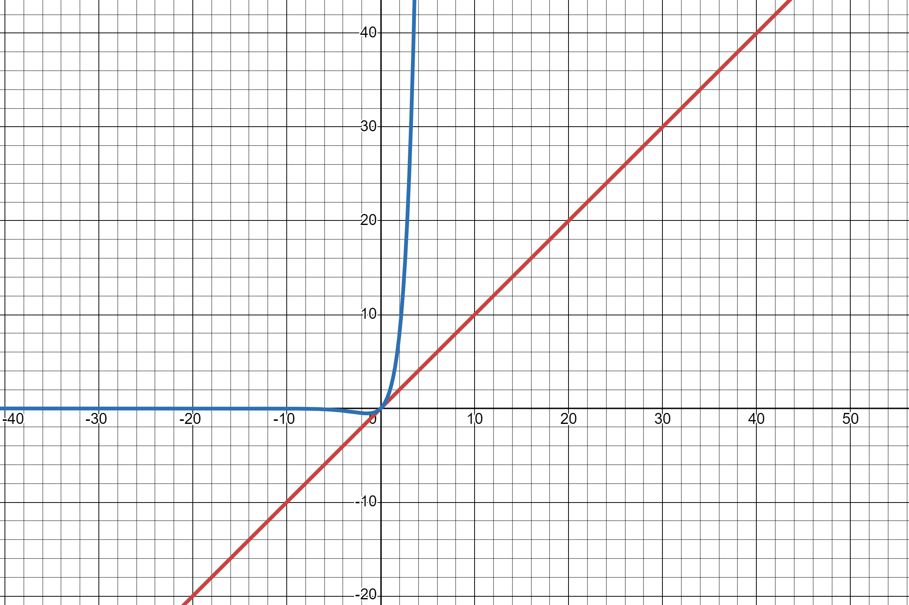
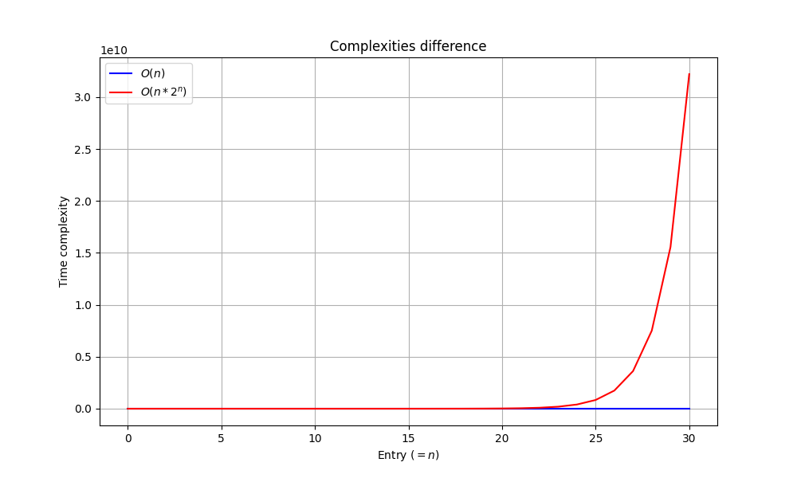

Obsidian, because of it's crossplatform support, does not treat extensions as case-insensitive, meaning both variations of `txt` and `TxT` are different extensions for the app.

This is the same problem for both VS Code and Obsidian any many other applications if they simultaionasly support both Windows and UNIX-like system (e.g. Linux): this happens because in Windows, even if disk supports this feature, all the extensions are case-insensitive, meaning you can (only if not exceptional cases) write same extensions with differents between case and they would coexist, but treated as equals.

> POSIX takes advantage of the full case sensitive mode, while MS-DOS, WOW, and Win32 subsystems use the case insensitive mode.

Linux not only provides any symbol available in the extensions of the filename, but also is a case-sensitive and because of this "strange" for common user behaviour occurs.

**You can read more about this topic:**
- https://superuser.com/questions/881804/case-sensitive-file-extensions-in-windows-and-linux

### Practice

So, plugin supports both case-insensitive and case-sensitive extensions system, and if it TURNED ON, every extension typed in every setting would be put through generator-function which creates $n*2^n$ combinations of upper- and lower-cases symbols for the extension, meaning:

```bash
txt -> [txT, tXt, Txt, tXT... TXT];
```

This feature is not turned on by default because of it's RAM usage and common algorithm complexity of $O(n*2^n)$ which can take humongous amounts of device computational resources.

**Little graphs to visualize computational differences:**




> [!Important]
> Note how in the second graph the data is not in sync with the math graph defined by functions.

Second graph shows exact reason why case-insensitive mode can be dangerous, lets dive in the data behind the graph to understand what is happening.

Graphs datasets are defined by "appending" values by linear rule, meaning their output looks like this:

1. Output of the $O(n)$:

```shell
[...16, 17, 18, 19, 20, 21, 22, 23, 24, 25, 26, 27, 28, 29, 30]
```

2. Output of the $O(n*2^n)$ of the same range:

```shell
[1048576, 2228224, 4718592, 9961472, 20971520, 44040192, 92274688, 192937984, 402653184, 838860800, 1744830464, 3623878656, 7516192768, 15569256448, 32212254720]
```

> [!Note]
> This row of numbers can't even be visualized correctly by Python's library `matploblib` for visualization because it breaks the scales, in case of JavaScript (TypeScript) numbers and collections behaviour would be worse, because Python deals with them better.
